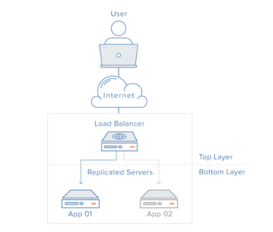
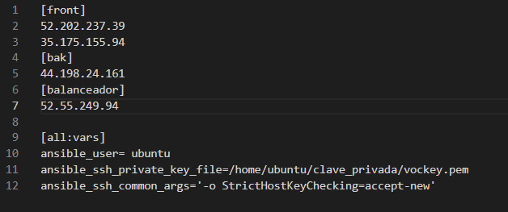
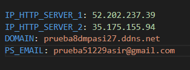
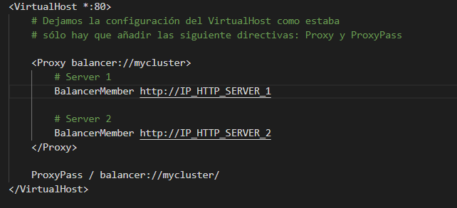
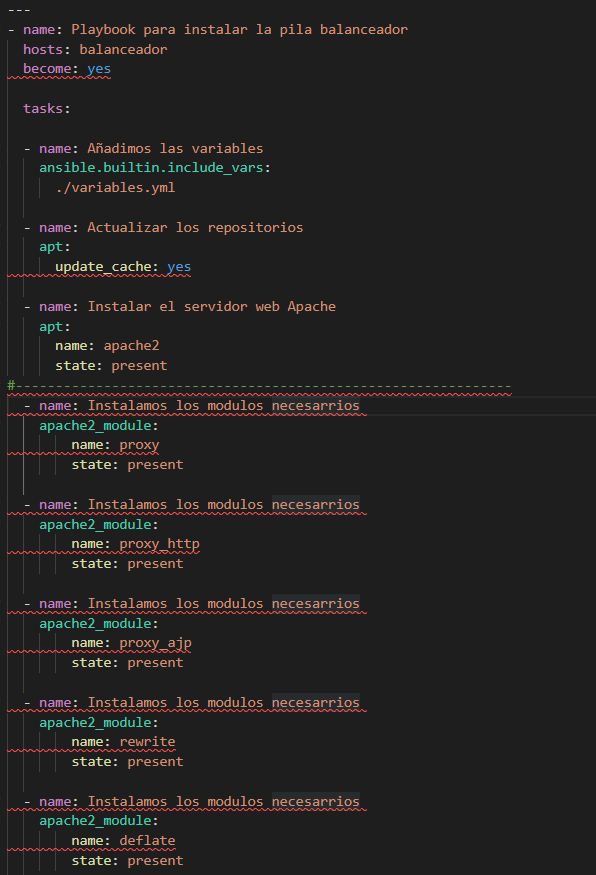
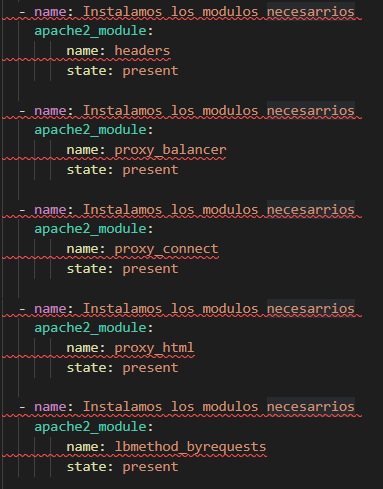
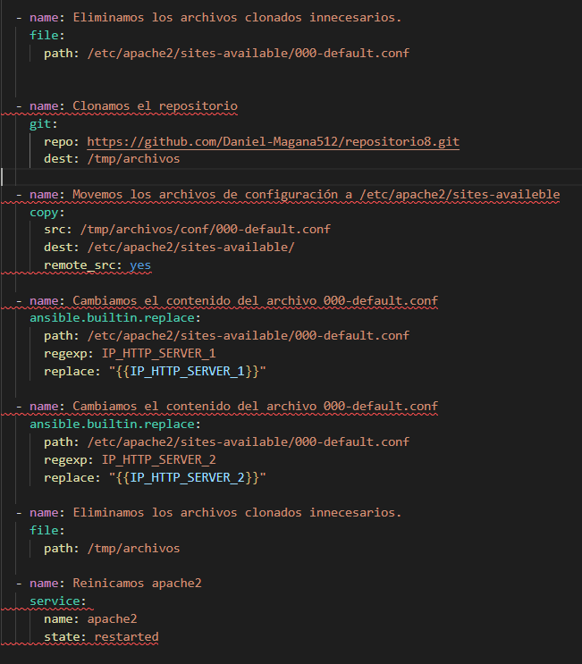
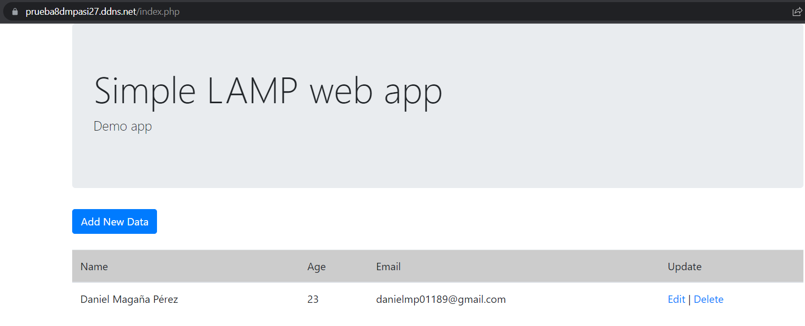
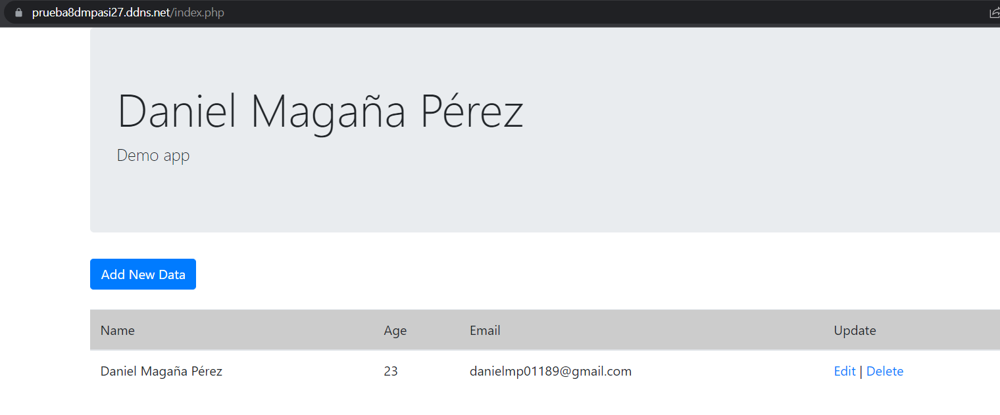

# Práctica 8 Balanceador de carga con Apache

*En esta práctica partimos de la configuración que hemos realizado en la práctica 7.*

**Recordar** *recordar que creamos dos maquinas:*
* **Una para el front-end**
* **Otra para el back-end**

En esta práctica vamos a tener dos front-end y un back-end, además le añadiremos el balanceador ( es un dispositivo hardware o software que se pone al frente de un conjunto de servidores y se encarga de asignar o balancear las peticiones que llegan de los clientes hacia los servidores).

De manera que **cuando nos conectemos al balanceador nada más que con darle al F5, nos llevará a otro front-end, de manera que con esta herramienta podremos acceder a todos los front-end.**

La estructura que queremos obtener será la siguiente:

## **Explicación previa**

En el inventario quedaría así;

Tendría 3 grupos:

* **Front-end**
* **Back-end**
* **balanceador**

Esto se debe a que los achivos de extensión **.yml** no a todos vamos a aplicarle la misma configuración por eso los ponemos por separado.

Ahora vamos al archivo de **variables.yml**

* **Ponemos las dos IPs publicas de las máquinas de front-end (lo suyo es que sean ip elásticas, esto se debe a que si esas IPs cambián cuando cerramos las máquinas el balanceador no funcionará, debido a que esas ip han cambiado).**

* **El siguiente paso es crear un dominio y un correo para que cuando accedamos al balanceador, sea a través del puerto 443, se debe al certificado**

## **Archivo de configuración**

Creamos un archivo que será el 000-default.conf

**Pondremos las variables definidas en el archivo llamado variables.yml, en esas variables van las IPs de los front-end, donde le estemos diciendo las URL para llegar a los front-end**

**Luego este archivo irá al directorio del balanceador /etc/apache2/sites-available/**

## **Archivo install_load_balancer.yml**

En este achivo vamos a instalar las herramientas necesarias y configuraciones que necesitará el balanceador.

* **Metemos el grupo del balanceador**

* **Actualizamos repositorios e instalamos el servidor de apache**

*Instalamos los modulos necesarios para que el la máquina funcione de balanceador*

* **proxy: Permite configurar el servidor web como un proxy inverso.**

* **proxy_http: Permite configurar el servidor web como un proxy inverso para el protocolo HTTP.**

* **proxy_ajp: Permite configurar el servidor web como un proxy inverso para el protocolo AJP (Apache JServ Protocol).**

* **rewrite: Permite al servidor reescribir las peticiones HTTP que recibe.**

* **deflate: Permite comprimir el contenido que se envía al cliente.**

* **headers: Permite al servidor web manipular las cabeceras de las peticiones/respuestas HTTP que envía/recibe.**

* **proxy_connect: Permite configurar el servidor web como un servidor proxy que puede establecer conexiones HTTPS con los servidores donde distribuye la carga, utilizando el método CONNECT de HTTP.**

* **proxy_html: Permite configurar el servidor web como un servidor proxy que puede filtrar y modificar el contenido HTML de las páginas web que se reciben de los servidores donde se distribuye la carga.**

* **Ahora vamos a llevar el archivo 000-defautl.conf que he mencionado en los apartados anteriores, para ello he usado una clonación (para clonar me obligaba a poner el repositorio público.)**

* **Elimino el archivo que haya 000-default.conf**

* **Clonamos el repositorio de esta práctica**

* **Desplazamos el archivo de configuración 000-default.conf al directorio /etc/apache2/sites-available/**

* **Cambiamos las dos variables por las IPs de las máquinas front-end del archivo 000-default.conf**

* **Eliminamos los archivos del directorio tmp**

* **Reiniciamos el servidor de apache**

Una cosa que no he mencionado antes , es que para que el balanceador use el puerto 443 tendremos que asociar su IP aún nombre de dominio, el archivo que se encargará de esa fase es install_cerbot, como ya lo he explicado en otros apartado no lo explicaré, ya que funciona de la misma forma.

## **Comprobación**

Si yo pongo el nombre del dominio en el navegador me aparece el index.php del primer front-end.

Ahora si le doy a la tecla **F5** me llevará a otra pantalla que es la del segundo front-end.

Puse mi nombre en el titulo de index.php para que se apreciara de que funciona.

